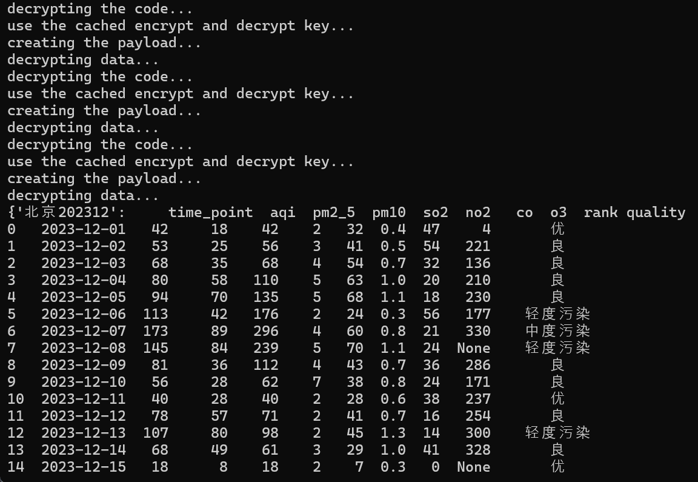

# AQI Data Crawler

用于从公开的数据中读取中国各城市的AQI数据以及实时的AQI数据。

## 更新历史

- 2025-01-30

  项目初始化。

## 简介

### 数据来源

- 各城市的历史AQI数据来源于[真气网](https://www.aqistudy.cn/)，目前支持全国大部分地级市的历史数据查询，最早可追溯数据为2013年12月。
- 实时的AQI数据来源于中国环境监测总站的[全国空气质量实时发布平台](https://air.cnemc.cn:18007),支持对于全国大部分地级市的实时空气质量查询，同时可以获取各监测点的实时数据。

### 项目结构

| 文件名称          | 文件描述                                         |
| ----------------- | ------------------------------------------------ |
| crypto-js-3.1.2   | js文件，用于提供MD5，AES,DES等加解密功能         |
| node_modules      | nodejs配置文件，项目需要使用cryptojs用于加解密   |
| cities.txt        | 爬虫处理的城市目录，项目读取该文件以生成爬取对象 |
| crawl.py          | 发起历史数据请求                                 |
| crawlPerHour.py   | 发起实时数据请求，在运行时每个整点发起一次爬取   |
| dataIO.py         | 本地文件的读写处理                               |
| decoder.py        | js文件，请求payload以及数据的加解密处理          |
| main.py           | 历史数据爬取操作的入口                           |
| package-lock.json | nodejs配置文件，项目需要使用cryptojs用于加解密。 |
| package.json      | nodejs配置文件，项目需要使用cryptojs用于加解密。 |
| requirements.txt  | 项目的python依赖项                               |

### 项目操作流程

#### 实时数据获取

实时数据获取较为简单，[全国空气质量实时发布平台](https://air.cnemc.cn:18007)为单页面网页，数据加载方式为发起请求后由后端发送以json格式存储的AQI数据。故而可以截取其中的数据文件（即https://air.cnemc.cn:18007/CityData/GetAQIDataPublishLive？cityName=）并进行json解码即可得到相应的数据。数据以pandas.dataframe的格式输出。

#### 历史数据获取

历史数据经过真气网进行加密处理，同时在请求中进行了payload加密，故而需要进过多次的加解密过程。

- 请求加密文件

  真气网中的数据采用动态加载的方式，通过对daydata.php可以得到其通过文件de5CQkNmdaJwo.min.js请求对应的数据。（需要声明，该文件的命名可能为动态命名，需要找到相应的文件）

  
  
  
- 加密文件解密

  de5CQkNmdaJwo.min.js采用了eval混淆的方式对js文件进行了加密以降低可读性。在浏览器中可以在控制台中将eval换成console.log进行eval反混淆。但是由于需要进行自动化操作，故而采用你直接执行的方式——使用js2py库直接执行eval函数。在反混淆两次后发现其存在一个*k()*函数以及一个*dweklxde()*函数，直接执行eval代码使其解密。（该部分详见decoder.py中的*eval_decoder()*函数）

  

- payload加密分析

  通过解密后的de5CQkNmdaJwo.min.js可以发现其请求的数据文件为historyapi.php。故而在调试界面中找到该请求（需要注意的是，浏览器采用cache模式，需要更换城市或月份才会请求该文件）,观察可以发现以下两点。

  - 请求的header部分需要附带对daydata.php的请求作为referer，同时网址携带请求的城市以及月份作为参数.

    

  - 请求的payload部分经过加密，为一个key为"hA4Nse2cT"的键值对。

    

  观察de5CQkNmdaJwo.min.js文件，可以得到payload的处理方式为：

  - 硬编码appID，clienttype，并取当前时间作为timestemp。

  - 将appID，method，timestamp，clienttype， object拼接后进行MD5加密取16进制表示作为验证的secret。

  - 将所有参数作为json后转文字进行base64加密。

  - 使用一组密钥对base64加密后的字符串进行AES加密。

    

  故而对payload中的加密部分进行逆操作可以得到method参数为“GETDAYDATA”,object参数为包含城市以及时间的键值对{“city” ：“”，“month” ：“”}，故而可以通过以上方式模拟数据请求中的payload。

  

- 秘钥获取

  通过对de5CQkNmdaJwo.min.js的解密可以发现其中存在着四组key与iv分别用于AES与DES的加解密操作。同时根据其在代码中出现的不同位置可以定位其用于加密或者解密。故而直接通过正则匹配的方式从解密后的js文件中获取对应的key与iv。并且取得对应的appID。（该部分详见decoder.py中的*re_extractor()*）函数）

  同时根据观察，短期内其使用的密钥以及appID不会发生变化，故而使用函数*re_extractor_observe()*缓存了对应的key，iv以及apID以减少请求次数。如果发生密钥以及appID更换，请修改main.py中line27的函数为*re_extractor()*以更新。

- data解密分析

  通过对de5CQkNmdaJwo.min.js的解密可以发现在完成请求后调用了函数*dxvERkeEvHbS()*用于处理返回的数据。追踪该函数，可以发现该函数用于解密返回的数据。数据经过base64$\rightarrow$DES$\rightarrow$AES$\rightarrow$base64进行解密。（该部分详见decoder.py中的*data_decoder()*函数）

  

基于上述的分析，可以伪造payload发送请求并解密返回的数据。需要注意的是，对historyapi.php的请求header需要附带对应的城市以及月份信息。同时json文件在符号间间隔空格的编码规范造成payload加密中object部分多出两个空格，这将导致secret的编码非法。故而需要使用replace移除空格。

### 项目运行

- 环境配置

  由于项目需要运行解密后的js代码，故而需要配置nodejs运行环境。如果主机中未安装nodejs环境，请先进行环境配置。

  项目建议采用conda进行环境配置。

  ```shell
  pip install -r requirements.txt
  ```

- 参数配置

  项目中读取城市名录cities.txt以及爬取的起止时间作为参数。

  - cities.txt

    爬取前请配置项目根目录下的cities.txt文件，其中的城市名请使用中文书写，且不要附带“市”等后缀。各城市名之间使用空格进行间隔。

  - 爬取的起止时间

    该部分参数只有爬取历史数据时需要进行配置。在项目入口文件中main.py中通过函数*process_month_param()*加载，请按照“年份月份”的格式修改参数，月份采用两位数字编码（即1月为01,2月为02，依此类推）。爬取的月份包含输入的起止月份。

- 项目运行

  - 实时数据获取

    在完成配置的情况下运行

    ```python
    python crawlPerHour.py
    ```

    即可得到对应城市的dataframe.

    

  - 历史数据获取

    在完成配置的情况下运行

    ```python
    python main.py
    ```

    即可得到对应城市与月份的dataframe。项目最后得到一个由dataframe组成的dict，key为“城市名爬取月份”，value为对应月份的AQI数据组成的dataframe。
    
    